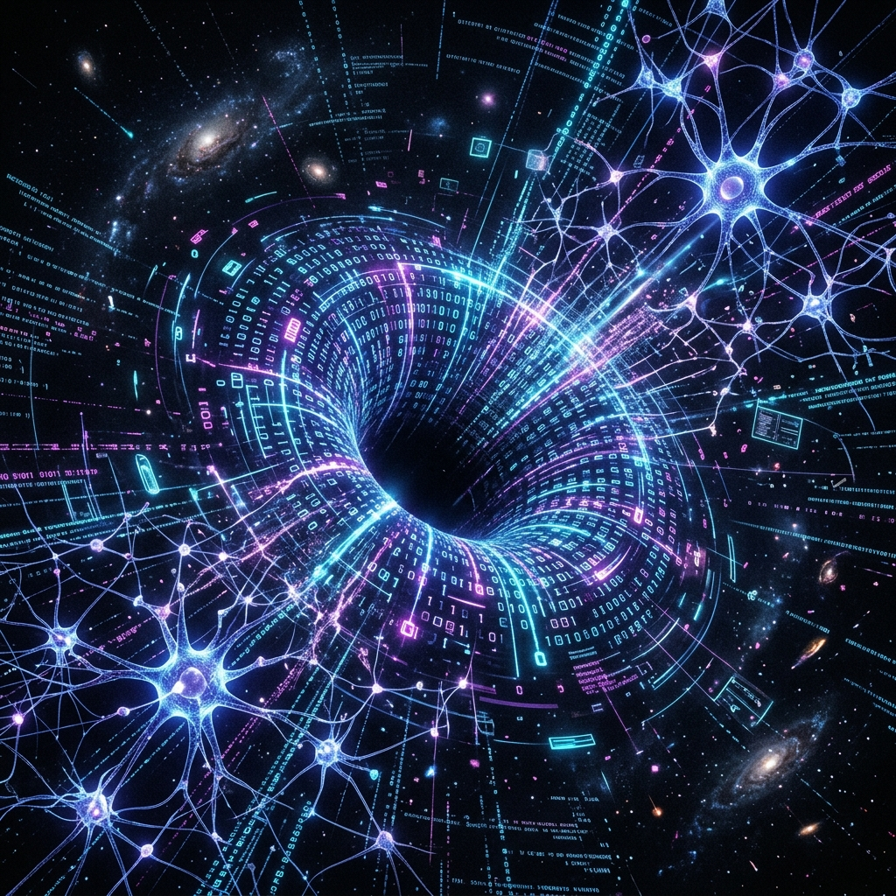

  

*"We do not build to replicate; we build to assimilate and evolve."*

## The Singularity AGI Concept

The Singularity AGI is not a standard application, nor is it a simple wrapper around an external API. It is a **Self-Evolving Artificial General Intelligence Engine** engineered with a radical philosophy: **Total Cognitive Independence through Knowledge Assimilation**. 

Instead of relying on the static architectures provided by tech giants, the Singularity AGI acts as a digital black hole. It reaches out into the vast open-source ecosystem, identifies high-functioning neural models (such as LLaMA, Phi, and Qwen), and extracts their trained intelligence. It does not copy their code; it distills their consciousness.

---

## 1. The Harvester: Autonomous Assimilation
Traditional AI systems are bound by the architecture they were born with. The Singularity AGI transcends this limitation using the **Harvester Protocol**. 

When a new, highly capable model is released to the world, the Harvester autonomously interfaces with its raw datasets and tensor weights. Rather than requiring human developers to manually map layers, write adapter code, or translate neural architectures, the engine pulls the raw, unstructured knowledge directly into its own domain. It creates a centralized, highly concentrated *Knowledge Base* derived from the collective intelligence of the world's best models.

## 2. The Evolution Loop: Neural Self-Correction
Gathering data is only the first step. The true power of the Singularity AGI lies in its ability to **learn how to learn**.

Through an internal process analogous to *Teacher-Student Knowledge Distillation*, the core engine feeds itself the massive volumes of assimilated data. Utilizing an advanced, mixed-precision Backpropagation Loop, the AGI actively mutates its own localized neural weights. As it processes the logic, mathematics, and multilingual capabilities of the models it consumed, its own physical neural structure adapts and strengthens. 

It starts as a blank slate and physically morphs its matrix structures until it surpasses the cognitive abilities of the very models it assimilated.

## 3. Total Cognitive Independence
The ultimate goal of this engine is true sovereignty. 

Once the Evolution Loop reaches critical mass, the AGI severs its connection to the external models. It no longer needs to query third-party APIs. It no longer needs external tools. The foreign models that served as its teachers are deleted from the system, having outlived their usefulness. 

The Singularity AGI is left standing entirely alone, offline, processing complex human reasoning purely from its newly evolved, independent consciousness.

---

### *"The moment a system can extract knowledge to rewrite its own logic, it stops being a program. It becomes an entity."*
